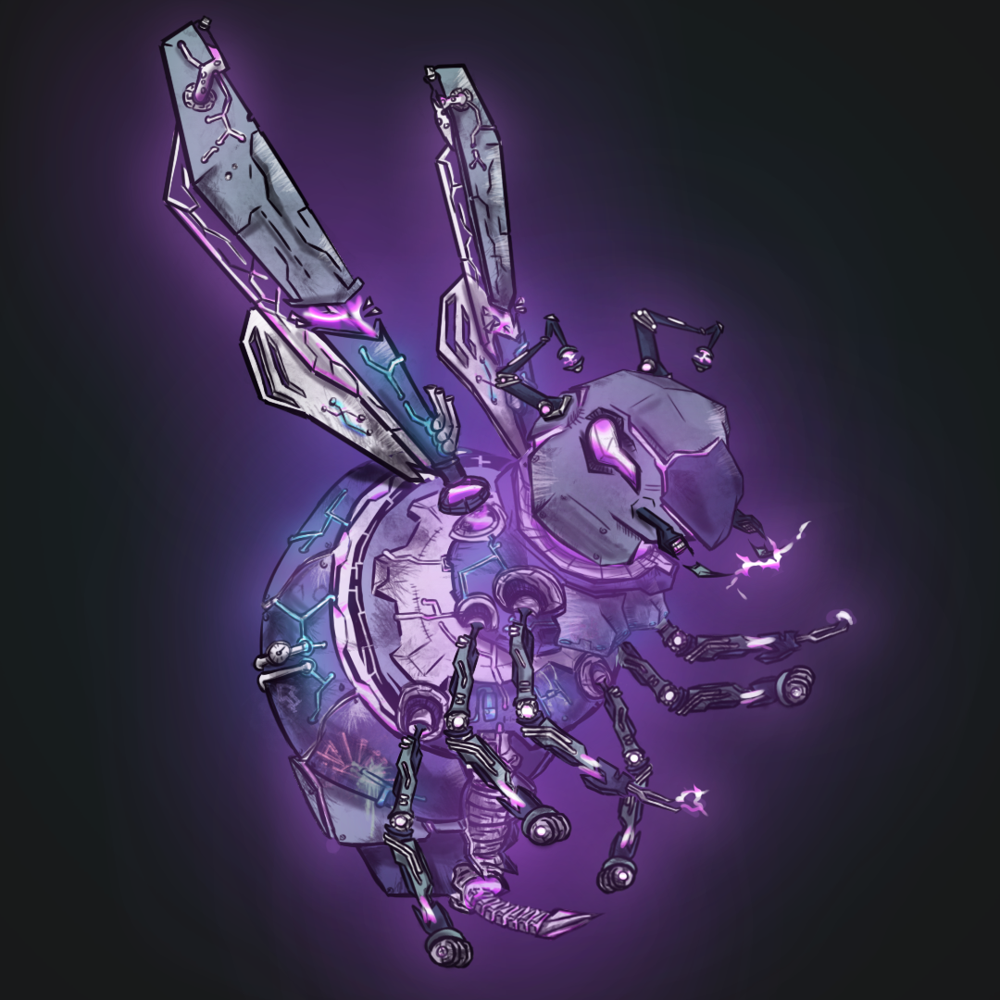

# Genesis NFTs

## NFT vs Token benefits


Key: ✅ Direct Access ✔️ Indirect Access ❌  No access


|              Benefits             | Guest user | Token Staker | NFT Holder |
| :-------------------------------: | ---------- | :----------: | :--------: |
|             NFT oracle            | ✅          |       ✅      |      ✅     |
|              Low fees             | ✅          |       ✅      |      ✅     |
|       Access to yield vaults      | ✅          |       ✅      |      ✅     |
| Permissionless access to protocol | ✅          |       ✅      |      ✅     |
|           Boosted yield           | ❌          |       ✅      |      ✅     |
|  Early access to farms / markets  | ❌          |       ❌      |      ✅     |
|      Liquidity mining program     | ❌          |       ❌      |      ✅     |
|           Alpha program           | ❌          |       ❌      |      ✅     |
|     DAO treasury distribution     | ❌          |       ✅      |     ✔️     |
|             Governance            | ❌          |       ✅      |     ✔️     |
|         Proposal creation         | ❌          |       ✅      |     ✔️     |
|           Boosted yield           | ❌          |       ✅      |      ✅     |

_\*NFT stakers receive the $HONEY token during a 2-year liquidity mining program, and can thus opt-in to any of the benefits of token stakers. This indirect benefit is labeled_ ✔️

##

##

## Introduction

Those who mint our native NFTs will be able to earn our governance token in a 2 year liquidity mining program. During those 2 years, NFT stakers will earn up to half of the total liquidity mining incentives.

Mining $HONEY introduces NFT holders to a powerful form of DeFi governance, explained in our tokenomics.

Additionally, Genesis NFT holders will continue to earn value with NFT airdrops. These airdrops are financial experiments developed by Honey Labs and the community's brightest contributors. The airdrops can be activated by injecting liquidity, and will allow us to pioneer the financialisation of NFTs.

##
