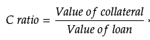

# Create a market

**Requirements for listing:**

* Market admin must hold at least 50k veHONEY
* NFT collection must use [metaplex standard](https://docs.metaplex.com/programs/token-metadata/token-standard)
* Collection must have a Switchboard oracle or create one

## Step 1 - Create a market



This will act as the name for your market.&#x20;

It can be changed at a later date by creating a pull request on github and pinging the Honey Labs team in our discord's builders channel.



This field allows the team and community to fill in any missing information about your collection by querying Magic Eden or your Solana marketplace of choice.

It isn't used to run any of Honey's infrastructure, but instead ties your market to an existing collection.

Using collections supported by Magic Eden makes creating an oracle much easier down the road, as you will be able to query floor prices via Magic Eden's API.




**This step is critical. Inputing an incorrect verified creator will render your market unusable.**


Most NFTs using [Metaplex's NFT standard](https://docs.metaplex.com/programs/token-metadata/token-standard) will have one or more addresses listed as verified creators.

Usually, this address will point to the candy machine which minted the NFTs.

## How to find the verified creator ?

We recommend going to Magic Eden and finding the page associated to this particular collection.

Once on that page, view the _details_ page for that NFT. On the NFT's page, you can scroll down to _details_ and find a field called **Mint address**. You can then pick whichever explorer you feel most comfortable with, this example uses Solscan:

On the explorer page for the NFT, you'll find a field called **Creators**. This will show the distribution of royalties, with the check mark indicating that a creator address is a verified creator address.

In most cases, the verified creator with 0% royalties will be the candy machine used to mint the NFT. Select this address and input it into Honey's market creation tool.

## Which verified creator to pick ?

In cases where your NFT collection has multiple verified creators, we recommend using the candy machine address.

**If your verified creator address is used by more than 1 collection, you should NOT use it. As other collections sharing the verified creator address could then be used as collateral in your market.**

Using the candy machine of a particular collection reduces this risk.



## Step 2 - Setup an oracle


Oracles are programs which value the collateral used in the market.

Honey Labs recommends using two separate oracles per market, a price oracle, and a TWAP oracle to average the price.




Even if your collection has an oracle on Switchboard, it's strongly recommended that you create your own.

Two oracles should exist for a market, a price oracle, tracking a floor price API for a given collection, and a TWAP oracle, which averages the given price over a set period of time.


Technically, any integer value received from the oracle will work for your market. Oracles can provide a constant number, or be manually set (no API tracking). If you have a use for this, then you are free to do so.


If you're confident with the oracle already present on Switchboard, you can provide the&#x20;



todo




